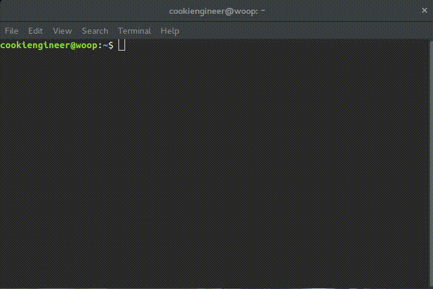
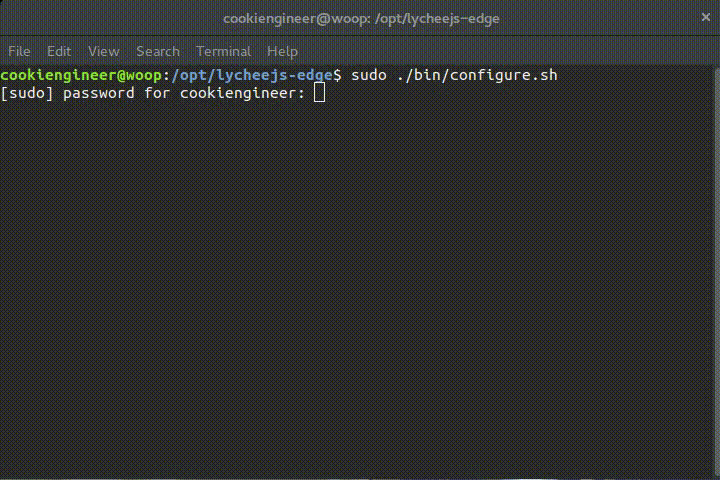

# lycheeJS (2016-Q1)

brought to you as libre software with joy and pride by [Artificial Engineering](http://artificial.engineering).

Support our libre Bot Cloud via BTC [1CamMuvrFU1QAMebPoDsL3JrioVDoxezY2](bitcoin:1CamMuvrFU1QAMebPoDsL3JrioVDoxezY2?amount=0.5&label=lycheeJS%20Support).


## Overview

The following repositories are related to the lycheeJS project:

- [lycheeJS-bundle](https://github.com/Artificial-Engineering/lycheeJS-bundle.git) generates all OS-ready bundles.
- [lycheeJS-future](https://github.com/Artificial-Engineering/lycheeJS-future.git) contains concepts and ideas not yet finished.
- [lycheeJS-runtime](https://github.com/Artificial-Engineering/lycheeJS-runtime.git) contains all pre-compiled runtimes used by the Fertilizers.
- [lycheeJS-tutorial](https://github.com/Artificial-Engineering/lycheeJS-tutorial.git) generates all OS-ready tutorials.
- [lycheeJS-website](https://github.com/Artificial-Engineering/lycheeJS-website.git) contains the lycheeJS website.


lycheeJS is a Next-Gen Isomorphic Application Engine that
offers a complete solution for prototyping and deployment
of applications. The underlying technology stack does not
matter (HTML5, WebGL, OpenGL, OpenGLES, libSDL) and is
completely automated behind the scenes.

The project aims to ease up and automate the design and
development process of applications through intelligent
software bots that learn from your application code.

The development process is optimized for Blink-based
browsers (Chromium, Google Chrome, Opera) and their
developer tools.

The target platforms are described as so-called Fertilizers.
Those Fertilizers cross-compile everything automagically
using a serialized `lychee.Environment` that is setup in
each project's or library's `lychee.pkg` file.


| Target       | Fertilizer                   | Package  | arm | amd64 |
|:-------------|:-----------------------------|:---------|:---:|:-----:|
| Browser      | html                         |          |  ✓  |   ✓   |
| Linux        | html-nwjs, node, node-sdl    | bin      |  ✓  |   ✓   |
| OSX          | html-nwjs, node              | app, bin |     |   ✓   |
| Windows      | html-nwjs, node              |          |     |   ✓   |
| Android      | html-webview, node, node-sdl | apk, bin |  ✓  |   ✓   |
| BlackberryOS | html-webview, node, node-sdl | apk, bin |  ✓  |   ✓   |
| FirefoxOS    | html-webview                 | zip      |  ✓  |   ✓   |
| iOS          | html                         |          |     |       |
| Ubuntu Touch | html-webview, node, node-sdl | deb, bin |  ✓  |   ✓   |

The iOS Fertilizer has currently no support for cross-compilation
due to XCode limitations. You can still create an own WebView iOS
app and use the `html` platform adapter.

lycheeJS does not ship x86 (32 bit) runtimes in order to save hard disk
space. If you still have a x86 computer and want to use lycheeJS,
you have to fix (uncomment) at least the
[node/update.sh](https://github.com/Artificial-Engineering/lycheeJS-runtime/blob/master/node/update.sh)
script in the `./bin/runtime` folder and execute it once before
starting the `lycheejs-harvester`.


## Install lycheeJS

**1) Easy Way: Bundle Installation**

There are prebuilt bundles that ship all dependencies and
runtimes lycheeJS needs in order to work and cross-compile
properly. These bundles should be installed on the developer's
machine and not on the target platform.

Visit [lycheejs.org](http://lycheejs.org) for a list of available bundles.


**2) UNIX Way: Net Installation**

The netinstall shell script allows to automatically install
lycheeJS on any UNIX-compatible machine (arm or amd64).

Note that the lycheeJS toolchain has some dependencies, but those
are installed among typical GNU systems. We don't need any compiler
here as we ship our own runtimes as binaries.

```bash
sudo bash -c "$(wget -q -O - http://lycheejs.org/download/lycheejs-2016-Q1-netinstall.sh)";
```

The above commands will look similar to this if everything went fine.




**3) Awesome Way: Git Installation**

We love your contributions of any kind. Please consider reading
the [Contribution Guide](./guides/CONTRIBUTION.md) to get
you started in a couple minutes.

```bash
sudo mkdir -m 0777 /opt/lycheejs-edge;
cd /opt/lycheejs-edge;

git clone https://github.com/Artificial-Engineering/lycheeJS.git ./;
git checkout development;
git clone https://github.com/Artificial-Engineering/lycheeJS-runtime.git ./bin/runtime;
```


## Bootup lycheeJS

After you've installed lycheeJS, you can directly start the `lycheejs-harvester`.

The `./bin/configure.sh` script has to be executed initially one time as `root` in
order to compile down all the lycheeJS core libraries.

If you want a sandboxed installation without the awesome system-wide integration of
the `lycheejs-` tools, you can use the `--no-integration` flag.

```bash
cd /opt/lycheejs;

sudo ./bin/configure.sh;              # --no-integration if you want a sandboxed installation
lycheejs-harvester start development; # --no-integration if you want a sandboxed harvester
```

The above commands will look similar to this if everything went fine.




## Guides

These are the guides that should help you to get started as easy as possible.

Please let us know if we can improve anything in these documents [by opening an Issue directly on GitHub](https://github.com/Artificial-Engineering/lycheeJS/issues/new).  

- [Contribution Guide](./guides/CONTRIBUTION.md)
- [Codestyle Guide](./guides/CODESTYLE.md)
- [ECMAScript Guide](./guides/ECMASCRIPT.md)
- [Release Guide](./guides/RELEASE.md)


## License

lycheeJS is (c) 2012-2016 Artificial-Engineering and released under MIT / Expat license.
The projects and demos are licensed under CC0 (public domain) license.
The runtimes are owned and copyrighted by their respective owners and may be shipped under a different license.

For further details take a look at the [LICENSE.txt](LICENSE.txt) file.

