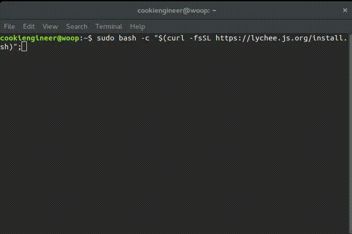
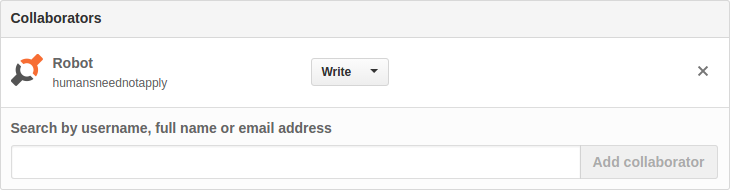

# lychee.js (2016-Q3)

brought to you as libre software with joy and pride by [Artificial Engineering](http://artificial.engineering).

Support our libre Bot Cloud via BTC [1CamMuvrFU1QAMebPoDsL3JrioVDoxezY2](bitcoin:1CamMuvrFU1QAMebPoDsL3JrioVDoxezY2?amount=0.5&label=lychee.js%20Support).

<details>
<summary>**QR Codes**</summary>

</details>

<details>
<summary>**Table of Contents**</summary>
- [Overview](#overview)
- [Features](#features)
- [Workflow](#workflow)
- [Platform Support](#platform--fertilizer-support)
- [Quickstart](#quickstart)
- [Developer Guides](#developer-guides)
- [Contributor Guides](#contributor-guides)
- [Help](#help)
- [License](#license)
</details>


## IMPORTANT NOTICE

We went live with our AI on 1. Sept 2016. This caused a totally fucked up
and necessary hard rebase. If your Fork does not contain the
`:balloon: AI History starts here` on its `master` branch, please delete
it and re-fork it again.

We hope that this will not occur again in future, but git has harsh
problems with rebases and squash-merges of overly complex branches
(read: 500k+ commits per day). So we essentially use that specific
commit to rebase onto from the `humansneednotapply` branch.

Thank you for your understanding.


## Work-in-Progress (aka alpha)

These are the things that we are currently working on:

- 2016-Q3: Strainer is being refactored to support better AI implementation.
- 2016-Q3: CARTEL (AI implementation) is being refactored. [Issue](https://github.com/Artificial-Engineering/lycheejs/issues/91)
- 2016-Q3: Guide is subject to change (to integrate the Editor). [Issue](https://github.com/Artificial-Engineering/lycheejs/issues/159)
- 2016-Q3: Editor is being refactored to integrate all other Cultivator Tools' functionalities.
- 2016-Q3: [lychee.js Garden](https://github.com/Artificial-Engineering/lycheejs-garden.git) is being implemented.


## Overview

The lychee.js Project started in 2012 and is in active development.
The following Repositories are related to the lychee.js Engine:

- [lychee.js CARTEL](https://github.com/Artificial-Engineering/lycheejs-cartel.git) contains all academic work related to the CARTEL/ES-HyperNEAT concept (WIP).
- [lychee.js Guide](https://github.com/Artificial-Engineering/lycheejs-guide.git) contains architecture explanations and concept documentations (WIP).
- [lychee.js Runtime](https://github.com/Artificial-Engineering/lycheejs-runtime.git) contains all pre-compiled lychee.js Runtimes and Fertilizers.
- [lychee.js Library](https://github.com/Artificial-Engineering/lycheejs-library.git) contains the lychee.js Library (installable via `bower` and `npm`).
- [lychee.js Harvester](https://github.com/Artificial-Engineering/lycheejs-harvester.git) contains the lychee.js Harvester (forked from `/libraries/harvester`).
- [lychee.js Website](https://github.com/Artificial-Engineering/lycheejs-website.git) contains the lychee.js Website (hosted at [https://lychee.js.org](https://lychee.js.org)).
- [lychee.js Bundle](https://github.com/Artificial-Engineering/lycheejs-bundle.git) generates the OS-ready lychee.js Bundles (published at [releases](https://github.com/Artificial-Engineering/lycheejs-bundle/releases) section).
- [lychee.js Future](https://github.com/Artificial-Engineering/lycheejs-future.git) contains all Concepts and Ideas not yet finished.

The following Accounts are related to the lychee.js Engine:

- [@cookiengineer](https://github.com/cookiengineer) is the core maintainer and founder of this project.
- [@humansneednotapply](https://github.com/humansneednotapply) is the account used by our software bots.


lychee.js is a [Next-Gen Isomorphic Application Engine](https://lychee.js.org/#!vision)
that offers a complete solution for prototyping, development,
maintenance and deployment of applications. The underlying
technology stack does not matter (HTML5, WebGL, OpenGL,
OpenGLES, libSDL) and is completely automated behind the
scenes.


## Features

The lychee.js Engine aims to deliver Total Automation through
Artificial Intelligence and better Software Architecture.

Everything listed here requires zero lines of code overhead
and is already fully integrated in the [lychee.js Boilerplate](./projects/boilerplate):
 
The lychee.js Core and Definition System:

- Isomorphic Application Engine (runs pretty much everywhere)
- Language is only ES5/ES6 JavaScript Code, nothing else
- Composite Pattern inspired Entity/Component System
- Definition System embraces Simplicity and Feature Detection
- Sandboxing System embraces automated Error Reports, Analytics and Debugging
- Serialization System allows Re-Simulation on any Platform
- Built-In Offline Storage Management and Network Synchronization

The lychee.js Software Bots:

- Graphical Asset Management and Entity/Scene Design Tool ([Editor](/projects/cultivator/editor))
- Graphical Project Management and Server Maintenance Tool ([Ranger](/projects/cultivator/ranger))
- Command-Line Continous Integration Server ([Harvester](/libraries/harvester))
- Command-Line Wizard for Projects and Libraries ([Breeder](/libraries/breeder))
- Command-Line Builder and Cross-Compiler ([Fertilizer](/libraries/fertilizer))
- Command-Line Fuzz-Tester and Code-Refactorer ([Strainer](/libraries/strainer))

Features of the lychee.js Software Bots:

- Automated Code Refactoring, Bug Fixing and Code Improvements
- Automated Design Tracking, Layout and Flow Optimization
- Automated Packaging for Embedded, Console, Mobile, Desktop and Server Apps
- Automated Deployment via git and Live-Updates
- Automated Reactive/Responsive UI/UX Components
- Automated Debugging, Network and UI/UX Flow Analysis
- Automated Testing and Integration with the AI
- Automated Networking (Peer-to-Peer HTTP1.1/2.0 and WS13 with Local/Global Discovery)
- Automated Network Services and Traffic Balancing/Sharding


## Workflow

Every (not sandboxed) lychee.js Harvester is connected to the
lychee.js Peer Cloud and is contributing to the evolutionary
AI's knowledge and improves its capabilities for all others.

The lychee.js Engine uses CARTEL/ES-HyperNEAT as an evolutionary
AI that is connected to a Botnet of lychee.js Harvesters. Each
and every Definition written in lychee.js contributes to the AI
so that it can predict, suggest and improve all other Projects.

The development process is optimized for Blink-based web
browsers (Chromium, Google Chrome, Opera) and their
developer tools. We honestly recommend NOT using Firefox
due to lack of developer and debugging tools nor has it
any remote debugging protocol.

We ain't doing HTML5 websites or single-page-webapps here. If you
want to teach lychee.js those Legacy Technologies, there's the
[lychee.js Legacy Library](https://github.com/Artificial-Engineering/lycheejs-legacy.git).


## Platform / Fertilizer Support

The target platforms are described as so-called Fertilizers.
Those Fertilizers cross-compile everything automagically
using a serialized `lychee.Environment` that is setup in
each project's or library's `lychee.pkg` file.


| Target       | Fertilizer                   | Package   | armv7 |  x86  | x86\_64 |
|:-------------|:-----------------------------|:----------|:-----:|:-----:|:-------:|
| Browser      | html                         | zip, html |   x   |   x   |    x    |
| GNU/Linux    | html-nwjs, node, node-sdl    | bin       |   x   |   x   |    x    |
| OSX          | html-nwjs, node, node-sdl    | app, bin  |       |       |    x    |
| Windows      | html-nwjs, node, node-sdl    | exe       |       |   x   |    x    |
| Android      | html-webview, node, node-sdl | apk, bin  |   x   |   x   |    x    |
| BlackberryOS | html-webview, node, node-sdl | apk, bin  |   x   |   x   |    x    |
| FirefoxOS    | html-webview                 | zip       |   x   |   x   |    x    |
| iOS          | html                         |           |   x   |       |         |
| Ubuntu Touch | html-webview, node           | deb, bin  |   x   |   x   |    x    |

The iOS Fertilizer has currently no support for cross-compilation
due to XCode's gcc limitations. You can still create an own WebView
iOS App and use the `html` platform adapter.


## Quickstart

This is the it-works-failsafe guide of how to install the lychee.js
Engine on your development machine. For everything related to Bundles,
Dev Ops, Security, Deployments and Virtualization - please consult the
[lychee.js Guide](https://github.com/Artificial-Engineering/lycheejs-guide.git).





**1) Installation**

The Net Installer automatically installs the lychee.js Engine
on any UNIX-compatible machine (arm, x86 or amd64). The only
requirements beforehand are working `bash`, `curl` and `git`.

The lychee.js Engine installation requires at least 2GB of free
memory space at `/opt/lycheejs`. 4GB are recommended to have a
fully working AI knowledge integration.

Depending on your internet connection speed, the installation
will take a couple minutes (needs to download ca. 500MB zip
file of runtime binaries which is hosted in the releases section
of the [lycheejs-runtime](https://github.com/Artificial-Engineering/lycheejs-runtime/releases)
repository).

Notes:

- GNU/Linux requires either of `apt-get`, `dnf`, `pacman`, `yum` or `zipper` installed beforehand.
- Mac OSX requires [brew](https://brew.sh) installed beforehand.
- FreeBSD/NetBSD requires `pkg` installed and [Linux Compatibility](https://www.freebsd.org/doc/handbook/linuxemu-lbc-install.html) activated beforehand.


```bash
# Install lychee.js Engine into /opt/lycheejs
sudo bash -c "$(curl -fsSL https://lychee.js.org/install.sh)";
```


**2) Bootup**

The `lycheejs-harvester` integrates all projects with the
Software Bots. Start the `development` profile and open
`http://localhost:8080` in your Blink-based Browser.

```bash
cd /opt/lycheejs;

# Bootup lychee.js Harvester
lycheejs-harvester start development;
```


**3) Integration**

The lychee.js Project is tightly integrated with our
Artificial Intelligence, which is represented by the account
[@humansneednotapply](https://github.com/humansneednotapply).

If you want to have our AI to learn and improve from your project
(read the LICENSE section for caveats first), you need to create a
[Personal Access Token](https://github.com/settings/tokens)
with `repo` rights and put the token in the `.github/TOKEN` file:

```bash
cd /opt/lycheejs;

echo "MY-PERSONAL-ACCESS-TOKEN" > .github/TOKEN;
```

Then you must add the account [@humansneednotapply](https://github.com/humansneednotapply)
to your lychee.js Project's repository collaborators in its
`Settings > Collaborators & teams` section.



Notes:

- You need to add @humansneednotapply to each of your lychee.js Projects' repositories.
- You do **not** need to add @humansneednotapply to your lychee.js Fork.


## Developer Guides

If you want to develop lychee.js Projects or Libraries, the
`lychee.js Guide` helps you to get started easily.

Please let us know if we can improve anything in these documents
by opening up an [Issue](https://github.com/Artificial-Engineering/lycheejs/issues/new).

- [lychee.js Guide](https://github.com/Artificial-Engineering/lycheejs-guide)


## Contributor Guides

- [Contribution Guide](./guides/CONTRIBUTION.md)
- [Codestyle Guide](./guides/CODESTYLE.md)
- [Release Guide](./guides/RELEASE.md)


## Help

If you have any questions, feel free to join us on
[#artificial-engineering @ freenode](https://webchat.freenode.net/?channels=%23artificial-engineering).

These are our official social media channels:

* Twitter: https://twitter.com/lycheejs
* Reddit:  https://reddit.com/r/lycheejs
* IRC:     [#artificial-engineering @ freenode](https://webchat.freenode.net/?channels=%23artificial-engineering).
* Email:   robot [insert an at here] artificial.engineering


## License

The lychee.js Engine (defined as [lycheejs](https://github.com/Artificial-Engineering/lycheejs.git)
repository) is (c) 2012-2016 Artificial-Engineering and released under
[MIT / Expat](./LICENSE_MIT.txt) license.

The generated code by our Artificial Intelligence (namely the GitHub Account
[@humansneednotapply](https://github.com/humansneednotapply) or the commit's
e-mail address `robot [ insert an at here] artificial.engineering`) is released
under [GNU GPL 3](./LICENSE_GPL3.txt) license.

The date of each commit is equivalent to the date (Central European Timezone)
of claimed copyright and license, no matter from which timezone or physical
location they were commited from.

The generated code by the Artificial Intelligence overrules the MIT / Expat
license in every case, with no exceptions. The code is distributed in a libre
way to guarantee free and open knowledge distribution for our Software Bots.

The projects (defined as `/projects` inside the [lycheejs](https://github.com/Artificial-Engineering/lycheejs.git)
repository) and their Assets are licensed under [CC BY-SA 4.0](./LICENSE_CC4-BY-SA.txt)
license.

The lychee.js Runtimes (defined as [lycheejs-runtime](https://github.com/Artificial-Engineering/lycheejs-runtime.git)
repository) are owned and copyrighted by their respective owners and those
may be shipped under a different license.

