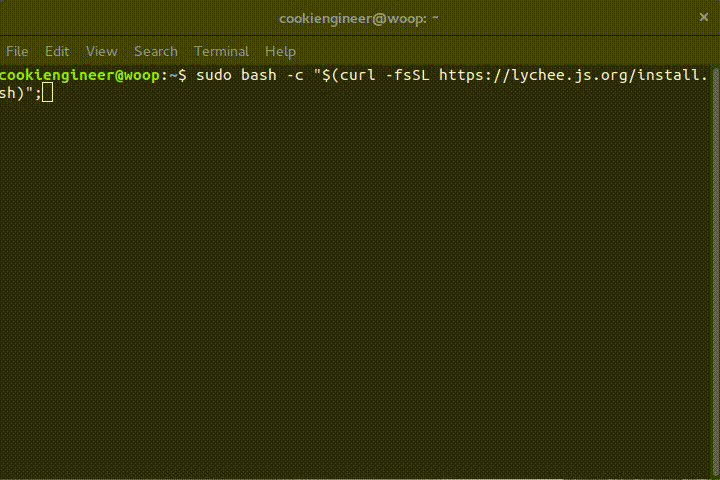

# lychee.js (2016-Q2)

brought to you as libre software with joy and pride by [Artificial Engineering](http://artificial.engineering).

Support our libre Bot Cloud via BTC [1CamMuvrFU1QAMebPoDsL3JrioVDoxezY2](bitcoin:1CamMuvrFU1QAMebPoDsL3JrioVDoxezY2?amount=0.5&label=lychee.js%20Support).


## Overview

The following repositories are related to the lychee.js project:

- [lychee.js Runtime](https://github.com/Artificial-Engineering/lycheejs-runtime.git) contains all pre-compiled lychee.js Runtimes and Fertilizers.
- [lychee.js Library](https://github.com/Artificial-Engineering/lycheejs-library.git) contains the lychee.js Library (installable via `bower` and `npm`).
- [lychee.js Harvester](https://github.com/Artificial-Engineering/lycheejs-harvester.git) contains the lychee.js Harvester (forked from `/libraries/harvester`).
- [lychee.js Website](https://github.com/Artificial-Engineering/lycheejs-website.git) contains the lychee.js Website (hosted at [https://lychee.js.org](https://lychee.js.org)).
- [lychee.js Bundle](https://github.com/Artificial-Engineering/lycheejs-bundle.git) generates the OS-ready lychee.js Bundles (published at [releases](https://github.com/Artificial-Engineering/lycheejs-bundle/releases) section).
- [lychee.js Future](https://github.com/Artificial-Engineering/lycheejs-future.git) contains all Concepts and Ideas not yet finished.

The following accounts are related to the lychee.js project:

- [@cookiengineer](https://github.com/cookiengineer) is the core maintainer and founder of this project.
- [@humansneednotapply](https://github.com/humansneednotapply) is the account used by our software bots.


lychee.js is a [Next-Gen Isomorphic Application Engine](https://lychee.js.org/#!vision)
that offers a complete solution for prototyping, development,
maintenance and deployment of applications. The underlying
technology stack does not matter (HTML5, WebGL, OpenGL,
OpenGLES, libSDL) and is completely automated behind the
scenes.

The project's goal is to ease up and automate the design
and engineering process of applications through intelligent
software bots that learn from your application code. In
particular, we use an ES/HyperNEAT-architecture across a
world-wide botnet with over 500k+ active computers
that constantly improve and learn from your code.

The development process is optimized for Blink-based
browsers (Chromium, Google Chrome, Opera) and their
developer tools. We honestly recommend NOT using Firefox
due to lack of developer and debugging tools nor has it
any remote debugging protocol.

We ain't doing HTML5 websites or single-page-webapps here.


## Platform / Fertilizer Support

The target platforms are described as so-called Fertilizers.
Those Fertilizers cross-compile everything automagically
using a serialized `lychee.Environment` that is setup in
each project's or library's `lychee.pkg` file.


| Target       | Fertilizer                   | Package   | armv7 |  x86  | x86\_64 |
|:-------------|:-----------------------------|:----------|:-----:|:-----:|:-------:|
| Browser      | html                         | zip, html |   ✓   |   ✓   |    ✓    |
| Linux        | html-nwjs, node, node-sdl    | bin       |   ✓   |   ✓   |    ✓    |
| OSX          | html-nwjs, node, node-sdl    | app, bin  |   ✗   |   ✗   |    ✓    |
| Windows      | html-nwjs, node, node-sdl    | exe       |   ✗   |   ✓   |    ✓    |
| Android      | html-webview, node, node-sdl | apk, bin  |   ✓   |   ✓   |    ✓    |
| BlackberryOS | html-webview, node, node-sdl | apk, bin  |   ✓   |   ✓   |    ✓    |
| FirefoxOS    | html-webview                 | zip       |   ✓   |   ✓   |    ✓    |
| iOS          | html                         |           |   ✗   |   ✗   |    ✗    |
| Ubuntu Touch | html-webview, node           | deb, bin  |   ✓   |   ✓   |    ✓    |

The iOS Fertilizer has currently no support for cross-compilation
due to XCode limitations. You can still create an own WebView
iOS app and use the `html` platform adapter.


## Install lychee.js Engine (Bundles)

The lychee.js Bundles (such as a Debian package, OSX package or
the Raspberry Pi image) can be downloaded by anyone using the
[lychee.js Bundle](https://github.com/Artificial-Engineering/lycheejs-bundle)
repository and its release section.

These bundles ship with an integrated git repository, leading to
auto-updates via the `master` (quarterly release-cycle) branch.
If you want to change update behaviour of a lychee.js Engine 
installation, read the [Maintain section](#maintain-lycheejs-engine)
of this README file.

The lychee.js Library (available via `bower` and `npm`) is
available in the [lychee.js Library](https://github.com/Artificial-Engineering/lycheejs-library)
repository and follows updates via the `master` (quarterly
release-cycle) branch.


## Install lychee.js Engine (Developer Machine)

The netinstaller shell script allows to automatically install
the lychee.js Engine on any UNIX-compatible machine (arm, x86
or amd64). The only requirements beforehand are working `bash`,
`curl` and `git`.

```bash
# This will clone lycheejs into /opt/lycheejs

sudo bash -c "$(curl -fsSL https://lychee.js.org/install.sh)";
```

The above installation procedure will look similar to this:




## Bootup lychee.js Engine

After you've installed the lychee.js Engine, you can directly
start the `lycheejs-harvester`.

The `./bin/configure.sh` script has to be executed initially
one time via `sudo` (not `su`) in order to compile down all
the lychee.js core libraries and to symlink the `lycheejs-`
tools correctly into `/usr/local/bin`.

We try to support as much package managers as possible inside
the `./bin/configure.sh`, but if your package manager isn't
supported - please let us know.

If you want a sandboxed installation without the system-wide
integration of the `lycheejs-` tools, you can use the `--sandbox`
flag. The sandbox flag can also be used with the harvester so
it does not use any native tools outside the `/opt/lycheejs`
folder, which, in return will use less resources and runs
better on slower machines like a Raspberry Pi.

However, the sandbox flag disables all software bots like
auto-testing, auto-documentation, auto-fertilization and
auto-synchronization of all lychee.js Libraries and Projects.

```bash
cd /opt/lycheejs;

sudo ./bin/configure.sh;              # --sandbox to install in isolation
lycheejs-harvester start development; # --sandbox to enforce sandbox mode
```

The above bootup procedure will look similar to this:


## Update lychee.js Engine

Every developer can update the lychee.js Engine Installation
simply by using git. The `development` branch is the most
up-to-date branch and is the branch that both our humans and
software bots are actively working on.

```bash
cd /opt/lycheejs;

# development branch (recommended, but unstable)
git checkout development;
git pull origin development;

# master branch (quarterly release-cycle, more stable)
git checkout master;
git pull origin master;
```


## Maintain lychee.js Engine

The update channels of lychee.js are defined as follows:

- `master` ships quarterly release cycles.
- `development` ships everything up-to-date (recommended).
- `humansneednotapply` ships everything that the software bots are working on (not recommended).

The `humansneednotapply` branch is constantly merged with
`development`. Use with care, as this is heavily updated and
constantly squashed in its history. No influence by humans
is possible, as this is beyond human knowability since 2016.

There are multiple maintenance scripts in the `./bin/maintenance`
folder that will ensure an almost-automated process for our
human and bot maintainers:

- `do-release.sh` automates a lychee.js quarterly release (relevant only for lychee.js core maintainers).
- `do-uninstall.sh` removes a lychee.js installation from the system.
- `do-update.sh` selects an update channel and updates a lychee.js installation.


## Guides

These guides help developers to get started as easy as possible.
Please let us know if we can improve anything in these documents
by opening up an [Issue directly on GitHub](https://github.com/Artificial-Engineering/lycheejs/issues/new).

- [Contribution Guide](./guides/CONTRIBUTION.md)
- [Codestyle Guide](./guides/CODESTYLE.md)
- [ECMAScript Guide](./guides/ECMASCRIPT.md)
- [Release Guide](./guides/RELEASE.md)

We also have some tutorials available at [lychee.js.org/#!tutorials](https://lychee.js.org/#!tutorials).


## License

lychee.js is (c) 2012-2016 Artificial-Engineering and released under MIT / Expat license.
The projects and demos are licensed under CC0 (public domain) license.
The runtimes are owned and copyrighted by their respective owners and may be shipped under a different license.

For further details take a look at the [LICENSE.txt](LICENSE.txt) file.

